> 寻找高质量论文的途径和策略

### 一、 主流通用平台（你的日常“图书馆”）

这些平台覆盖面广，是你最常使用的工具。

| 平台名称 | 特点与使用场景 |
| :--- | :--- |
| **arXiv.org** | **计算机领域科研人员的生命线！** 最新研究的预印本平台，比正式出版快1-2年。**技巧**：关注 `cs.CV` 类别，但要注意，上面的论文未经同行评审，需自行判断质量。 |
| **Google Scholar** | **最通用的学术搜索引擎。** 可以追踪一篇文章的引用脉络，找到某个学者的全部工作。**强烈建议**：在校内网络环境下设置图书馆链接，以便直接下载全文。 |
| **IEEE Xplore** | **IEEE旗下会议和期刊的官方库。** CVPR、ICCV、TPAMI等都在这里。是获取**最终版、高质量**论文的首选。 |
| **ACM Digital Library** | **ACM协会的数据库。** 虽然计算机视觉顶会多在IEEE，但一些跨领域的研究（如图形学、人机交互）会在这里找到。 |
| **DBLP** | **计算机科学领域的权威文献数据库。** 适合查找作者的发表记录和会议论文列表，但不提供全文下载。 |

**访问提示**：作为学生，务必通过**学校图书馆的数据库导航**访问这些平台，这样你才能免费下载全文。

### 二、 顶会/顶刊“直通车”（最精准的源头）

| CV顶会名称 | 简介 |
| :--- | :--- |
| **CVPR** | 计算机视觉和模式识别领域的顶级会议，与ICCV、ECCV并称计算机视觉三大顶会。每年录用大量论文，覆盖视觉领域的各个方面。 |
| **ICCV** | 国际计算机视觉大会，同样是计算机视觉领域的顶级会议，每两年举办一次，具有极高的学术影响力。 |
| **ECCV** | 欧洲计算机视觉国际会议，也是两年一届的顶级盛会，在全球范围内享有盛誉。 |

|顶刊名称|简介|
| :--- | :--- |
| **IJCV** | 《International Journal of Computer Vision》，计算机视觉领域的顶级期刊，发表高质量的原创研究论文。 |
| **TPAMI** | 《IEEE Transactions on Pattern Analysis and Machine Intelligence》，计算机视觉和模式识别领域的权威期刊，涵盖广泛的研究主题。 |
| **软件学报** | 中国一级期刊，CCF主办的权威期刊，发表计算机科学各领域的高水平研究成果。 |
| **计算机学报** | 中国一级期刊，CCF主办的综合性计算机科学期刊，涵盖计算机科学的多个研究方向。 |

想最高效地找到“高质量”论文，最直接的方法就是**直奔源头**。

1.  **直接访问顶会官网**：
    *   搜索 **"CVPR 2024 Open Access"** 或 **"ICCV 2023 main page"**，通常能找到官方发布的、带PDF链接的完整论文集。
    *   许多会议还有 **"CVPR Highlights"** 或 **"Best Paper Award"** 列表，这些是精华中的精华，非常适合新手起步。

2.  **关注顶刊官网**：
    *   在 **IEEE Xplore** 或期刊主页上，搜索 `"International Journal of Computer Vision"` 或 `"IEEE TPAMI"`，然后按**引用次数**或**下载量**排序，快速找到该期刊的经典和热门论文。

### 三、 高效发现与筛选策略（从“找到”到“找对”）

有了工具，如何高效使用是关键。下图为你展示了从海量文献中精准定位高质量论文的工作流：

**具体操作示例：**

*   **关键词搜索**：在IEEE Xplore中，将搜索范围限定为“CVPR 2024”，然后输入你感兴趣的关键词，如 `"vision transformer"` 或 `"image super-resolution"`。
*   **溯源法**：当你读到一篇高质量的综述或经典论文（例如，关于视觉Transformer的开山之作《An Image is Worth 16x16 Words》），它的**参考文献**是宝贵的“历史地图”，而**被引用文献**则是丰富的“发展脉络”。
*   **追随顶尖研究者**：在顶会论文中，你会反复看到一些名字（如Alex Kendall、Ross Girshick、Kaiming He等）。去访问他们的**个人主页**或他们所在的**实验室网站**（如FAIR, Google Research, MIT CSAIL），他们通常会把自己的代表作放在最显眼的位置。

### 四、 给博士新生的“起步”行动计划

1.  **第一周：建立认知**
    *   访问 **CVPR 2024** 官网，找到 **Best Paper Nominees** 和 **Oral** 论文列表（Oral通常代表评分最高的前5%）。
    *   挑选2-3篇你感觉有趣的Oral论文精读，感受顶会论文的深度和范式。

2.  **第二周：深入专题**
    *   确定一个你感兴趣的小方向（比如“目标检测”）。
    *   在 **Google Scholar** 搜索 `"survey object detection 2024"` 找一篇最新的综述论文。
    *   根据综述中提到的关键论文，去 **IEEE Xplore** 上下载3-5篇奠基性工作。

3.  **长期习惯：保持同步**
    *   每天花10分钟扫一眼 **arXiv.cs.CV** 的每日更新。
    *   关注你领域内顶尖学者和实验室的Twitter/X账号，他们通常会宣传自己的最新工作。

记住，作为博士生，**文献管理**（如使用Zotero, Mendeley）和**做阅读笔记**的习惯，与寻找论文本身同等重要。

