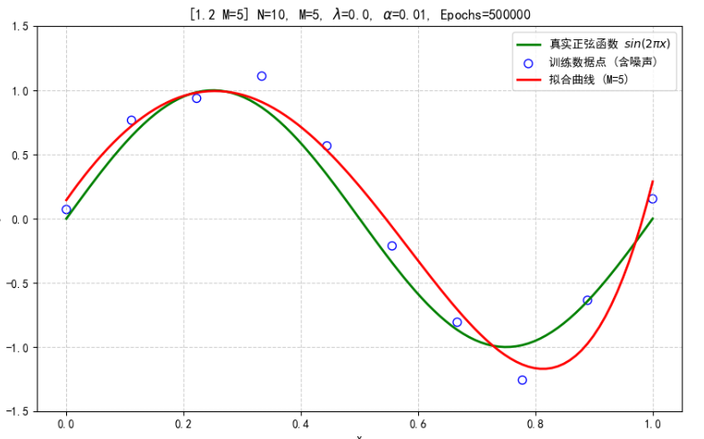
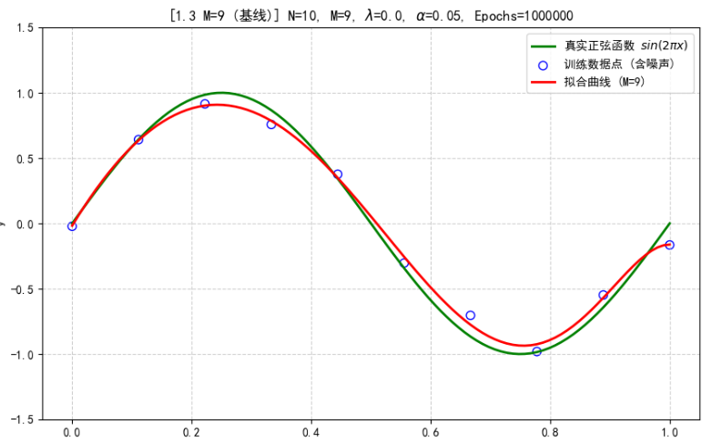
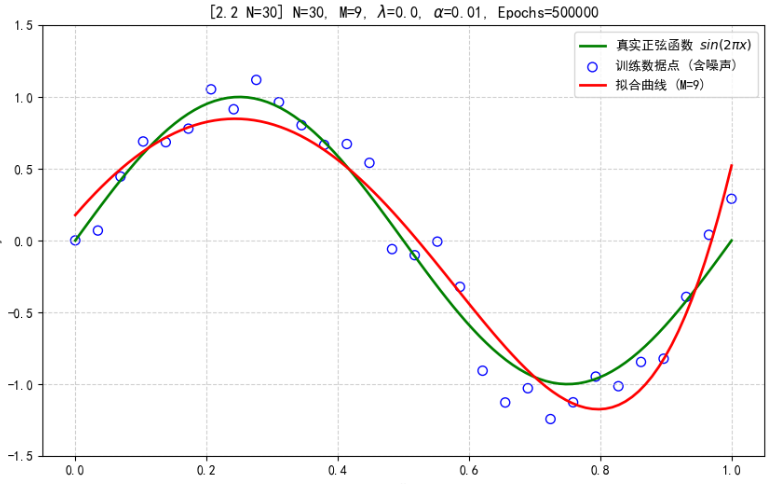
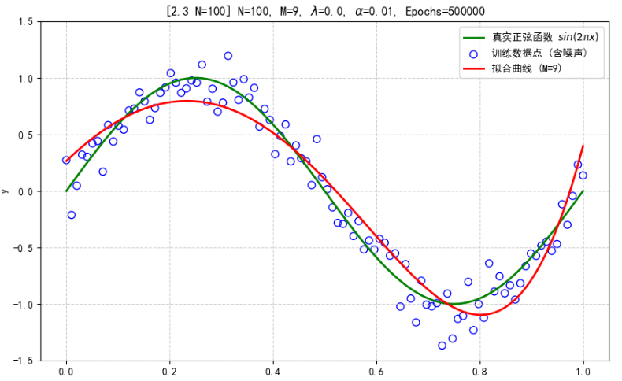
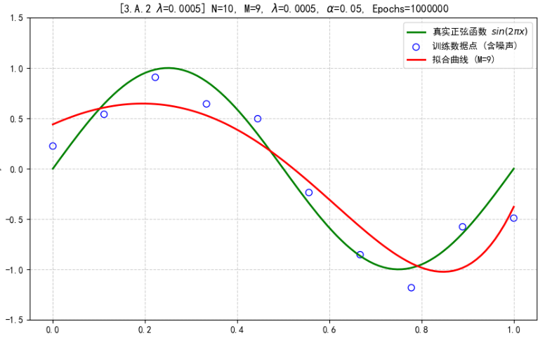
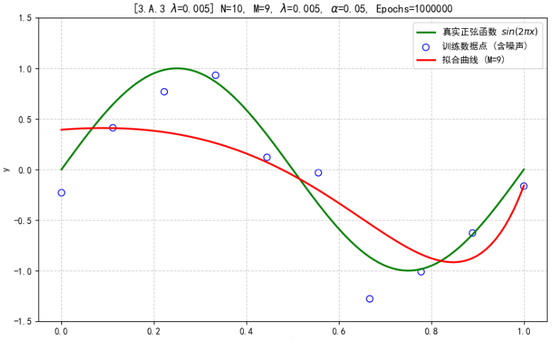
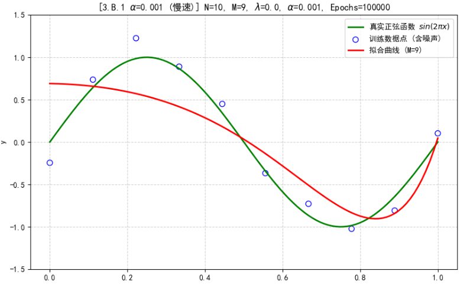
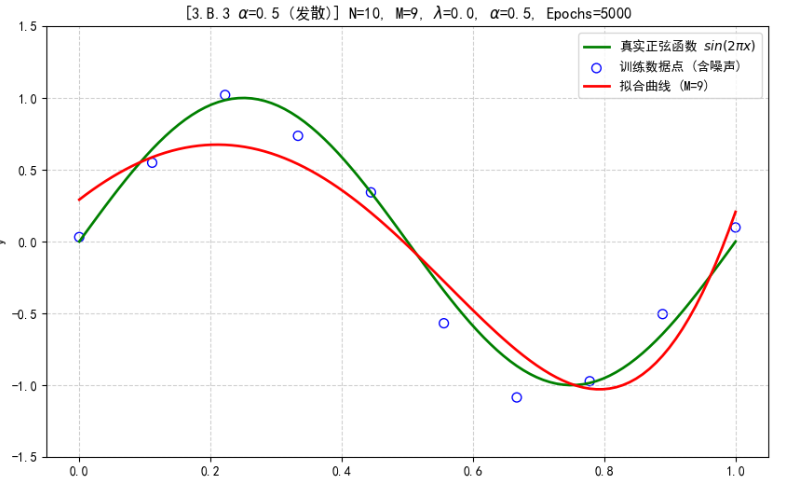
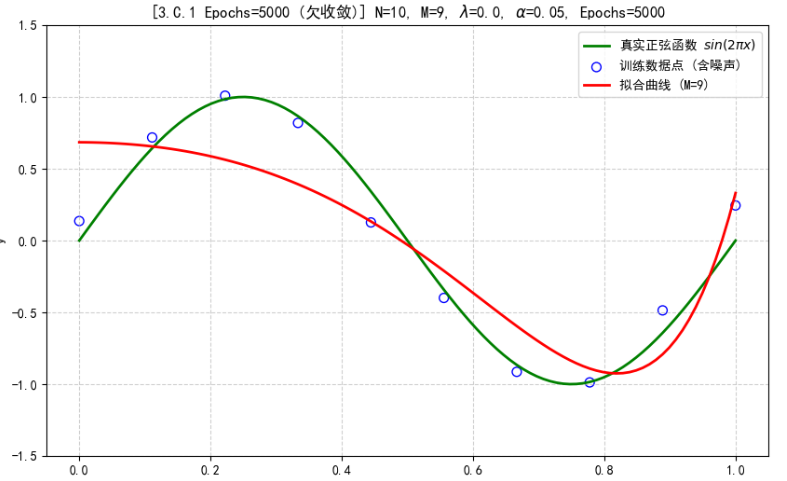

---
puppeteer:
    format: "A4"
    scale: 1.3
    margin:
        top: 2cm
        right: 3cm
        bottom: 2cm
        left: 3cm
---
<br/>
<br/>
<center> <font size = 5> 哈尔滨工业大学计算机科学与技术学院 </font></center>
<br/>
<br/>
<center> <font size = 7> 实验报告 </font></center>
<br/>
<br/>
<br/>
<center> <font size = 5> 
课程名称：机器学习 <br/>
课程类型：必修  <br/>
实验题目：多项式拟合正弦函数 
</font></center>
<br/>
<br/>
<center> <font size = 4> 学院：计算学部 </font></center>
<center> <font size = 4> 姓名：聂尔聪 </font></center>
<center> <font size = 4> 学号：25B903084 </font></center>
<center> <font size = 4> 日期：2025年11月27日 </font></center>

<div STYLE="page-break-after: always;"></div>
<!-- 此处用于换行 -->

# 一、实验目的
掌握机器学习训练拟合原理（无惩罚项的损失函数）、掌握加惩罚项（L2范数）的损失函数优化、梯度下降法、理解过拟合、克服过拟合的方法(如加惩罚项、增加样本)

# 二、实验要求及实验环境

## 实验要求
1. 生成数据，加入噪声；
2. 用高阶多项式函数拟合曲线（建议正弦函数曲线）；
3. 优化方法求解最优解（梯度下降）；
4. 用你得到的实验数据，解释过拟合。
5. 用不同数据量，不同超参数，不同的多项式阶数，比较实验效果。
6. 不许用现成的平台，例如pytorch，tensorflow的自动微分工具。建议实验编程环境：1）安装anaconda以及必要的工具包；2）建议采用python作为主编程语言，也可以根据个人需要和兴趣采用其它编程语言；3）可以基于实验室机器，也可以使用自己的便携式计算机上完成该实验。

## 实验环境
- 操作系统: Windows 11
- 编程语言: Python 3.11
- 主要库: NumPy, Matplotlib

# 三、设计思想

## 1.算法原理

### 1.1 多项式回归模型
对于给定的输入 $x$，我们希望用一个 $M$ 阶多项式来拟合它所对应的 $y$：
$$h_w(x) = \sum_{j=0}^{M} w_j x^j = w_0 + w_1 x + w_2 x^2 + \dots + w_M x^M$$
如果我们将特征向量定义为 $\mathbf{x} = [1, x, x^2, \dots, x^M]^T$，权重向量为 $\mathbf{w} = [w_0, w_1, \dots, w_M]^T$，则模型可以写为：
$$h_w(x) = \mathbf{w}^T \mathbf{x}$$
### 1.2 损失函数（均方误差）
我们使用均方误差（Mean Squared Error, MSE）作为损失函数，来衡量模型预测值与真实值之间的差距。对于 $N$ 个训练样本：
$$J(w) = \frac{1}{2N} \sum_{i=1}^{N} (h_w(x^{(i)}) - y^{(i)})^2$$
### 1.3 L2 正则化（Ridge Regression）
为了防止过拟合，我们可以在损失函数中加入 L2 正则化项（也称为权重衰减），它惩罚过大的权重值：
$$J(w) = \frac{1}{2N} \sum_{i=1}^{N} (h_w(x^{(i)}) - y^{(i)})^2 + \frac{\lambda}{2} \sum_{j=1}^{M} w_j^2$$
其中 $\lambda \ge 0$ 是正则化系数，是一个超参数。注意，我们通常不对偏置项 $w_0$ 进行正则化。
### 1.4 梯度下降法
我们使用梯度下降法来最小化损失函数 $J(w)$，迭代更新权重：
$$w_j := w_j - \alpha \frac{\partial J(w)}{\partial w_j}$$
其中 $\alpha$ 是学习率。
**梯度的计算：**
不带正则化时，梯度为：
$$\frac{\partial J(w)}{\partial w_j} = \frac{1}{N} \sum_{i=1}^{N} (h_w(x^{(i)}) - y^{(i)}) x_j^{(i)}$$
（其中 $x_j^{(i)}$ 是第 $i$ 个样本的第 $j$ 个特征，即 $(x^{(i)})^j$）
带L2正则化时，梯度为（$j \ge 1$）：
$$\frac{\partial J(w)}{\partial w_j} = \left[ \frac{1}{N} \sum_{i=1}^{N} (h_w(x^{(i)}) - y^{(i)}) x_j^{(i)} \right] + \lambda w_j$$
对于 $j=0$（偏置项），梯度不变。

## 2.算法的实现
1. generate_data: 生成 $N$ 个在 $[0, 1]$ 上的 $x$ 点，计算 $y = \sin(2\pi x)$，并添加高斯噪声。
2. create_polynomial_features: 将一维的 $x$ 向量 (大小 $N$) 转换为一个 $(N, M+1)$ 的特征矩阵 $X$，其中每一列是 $x$ 的 $0$ 到 $M$ 次幂。
3. compute_loss: 根据当前权重 $w$ 和特征矩阵 $X$ 计算预测值 $y_{pred}$，然后根据公式计算 MSE 损失和 L2 惩罚项。
4. compute_gradient: 根据公式手动计算损失函数对每个权重 $w_j$ 的偏导数。
5. train_polynomial_regression:
   - 初始化权重 $w$。
   - 在 epochs 次迭代中循环：
     - 计算预测值 $y_{pred} = Xw$。
     - 计算梯度 grad。
     - 更新权重 $w = w - \text{learning\_rate} \times \text{grad}$。
     - 记录损失。
6. run_experiment: 封装整个流程，调用数据生成、训练和绘图函数，用于进行不同参数组合的对比实验。

# 四、实验结果分析
我们进行了九组对比实验，均使用 $y = \sin(2\pi x)$ 作为目标函数，主要探究多项式阶数 $M$、样本数 $N$ 和 L2 正则化系数 $\lambda$ 对拟合效果的影响。
## 实验组一：多项式阶数 $M$ 对拟合的影响 (固定 $N=10, \lambda=0$)
本组实验固定训练样本数 $N=10$ 且不使用正则化，通过改变多项式阶数 $M$ 来观察模型复杂度的影响。
实验编号 | N (样本数) | M (阶数) | λ (正则化) | 拟合现象       | 核心结论
--------|------------|----------|-------------|----------------|----------------
1.1     | 10         | 3        | 0.0         | 欠拟合 (Underfitting) | 模型过于简单，无法捕捉正弦曲线的复杂规律。
1.2     | 10         | 5        | 0.0         | 适度拟合       | 模型复杂度有所提升，可以大致描绘曲线趋势。
1.3     | 10         | 9        | 0.0         | 过拟合 (Overfitting) | 模型复杂度远超数据量，完美拟合了噪声，曲线剧烈振荡。

**运行结果：**
|1.1|1.2|1.3|
|---|---|---|
||||

**分析：**
- **M=3** 时曲线过于平滑，无法匹配正弦函数的弯曲形态，证实了欠拟合。
- **M=9** 时，模型拥有了极高的自由度，为了最小化训练误差，它会强行穿过每一个噪声点，导致拟合曲线在非训练区域剧烈振荡，这正是典型的过拟合现象。
## 实验组二：样本数 $N$ 对拟合的影响 (固定 $M=9, \lambda=0$)
本组实验固定高阶多项式 $M=9$ 且不使用正则化，通过增加训练样本数 $N$ 来观察对过拟合的抑制作用。
实验编号 | N (样本数) | M (阶数) | λ (正则化) | 拟合现象       | 核心结论
--------|------------|----------|-------------|----------------|----------------
2.1     | 10         | 9        | 0.0         | 严重过拟合 (基线) | 曲线剧烈振荡。
2.2     | 30         | 9        | 0.0         | 振荡减轻     | 拟合曲线开始平滑，但仍有高阶模型痕迹。
2.3     | 100        | 9        | 0.0         | 良好拟合     | 拟合曲线非常接近真实正弦函数。 

**运行结果：**
|2.1|2.2|2.3|
|---|---|---|
||||

**分析：**
- 对比实验 2.1 ($N=10$) 和 2.3 ($N=100$) 可以看到，当数据量增加时，即使模型复杂度很高 ($M=9$)，模型也会更倾向于学习数据的真实底层规律（正弦函数），而不是去迎合少数噪声点。这证明了增加数据量是克服过拟合最根本、最有效的手段之一。
## 实验组三：训练超参数 ($\lambda, \alpha, Epochs$) 对训练的影响 (固定 $N=10, M=9$ 基线)
本组实验固定在最容易过拟合的设置 ($N=10, M=9$) 下，通过调节不同的超参数来观察其对收敛速度和模型复杂度的影响。
### 子实验 A: L2 正则化系数 $\lambda$ 的影响
实验编号 | N | M | λ | 拟合现象       | 核心结论
--------|---|---|---|----------------|----------------
3.A.1   | 10 | 9 | 0.0         | 严重过拟合 (基线) | 曲线剧烈振荡，权重值巨大。
3.A.2   | 10 | 9 | 0.0005      | 弱正则化     | 曲线振荡略有减轻。
3.A.3   | 10 | 9 | 0.005       | 强正则化     | 曲线变得高度平滑，有效缓解过拟合。

**运行结果：**
|3.A.1|3.A.2|3.A.3|
|---|---|---|
||||

**分析：**
- L2 正则化项惩罚了过大的权重，$\lambda$ 越大，权重被抑制得越厉害，模型自由度越低，拟合曲线越平滑，从而缓解过拟合。
### 子实验 B: 学习率 $\alpha$ 的影响
实验编号 | α (学习率) | Epochs | 拟合现象       | 核心结论
--------|------------|---------|----------------|----------------
3.B.1   | 0.001      | 1M      | 收敛慢，欠收敛 | 损失下降缓慢，100万轮后仍未能完全拟合训练点。
3.B.2   | 0.05       | 1M      | 充分收敛 (基线) | 损失快速下降，达到最小训练误差，表现为严重过拟合。
3.B.3   | 0.5        | 50K     | 发散/不稳定 | 损失函数急剧增大或剧烈振荡，权重爆炸，无法找到最优解。

**运行结果：**
|3.B.1|3.B.2|3.B.3|
|---|---|---|
||||

**分析：**
- 学习率 $\alpha$ 控制了参数更新的步长。$\alpha$ 过低会导致模型训练效率低下，耗时过长。$\alpha$ 过高则可能导致梯度下降跨过最优解，使损失函数无法收敛，甚至发散。
### 子实验 C: 训练轮数 $Epochs$ 的影响
实验编号 | α | Epochs | 拟合现象       | 核心结论
--------|---|---------|----------------|----------------
3.C.1   | 0.05 | 55000  | 欠收敛       | 模型在训练曲线上表现为欠拟合或适度拟合，尚未达到全局最优解。
3.C.2   | 0.05 | 1M     | 充分收敛 (基线) | 模型完全收敛到训练误差的最小值，展现出最严重的过拟合现象。

**运行结果：**
|3.C.1|3.C.2|
|---|---|
|||

**分析：**
- 训练轮数 $Epochs$ 决定了模型是否有足够的机会收敛。$Epochs$ 过少会导致模型在训练数据上尚未学习充分，表现为欠收敛。只有在 $Epochs$ 充足时，模型才能达到训练误差的最小值，并充分展现其在当前参数设置下的拟合（或过拟合）能力。

# 五、结论
通过本次三组实验的对比分析，我们系统地验证了多项式回归中的欠拟合、过拟合现象及其克服方法，并分析了超参数对训练稳定性和结果的影响：
- **模型复杂度 ($M$) 的影响**：$M$ 过低导致欠拟合；$M$ 过高且数据量不足则导致过拟合。理想的 $M$ 应与数据的内在复杂度相匹配。
- **数据量 ($N$) 的影响**：增加训练样本数量（$N$）是克服过拟合最有效的方式。充足的样本量可以平均化噪声，迫使复杂模型去学习底层规律。
- **训练超参数（$\lambda, \alpha, Epochs$）的影响**：
    - 学习率 $\alpha$ 必须适中。过低会导致收敛缓慢，训练效率低；过高会导致训练不稳定甚至发散。
    - 训练轮数 $Epochs$ 必须充足，以保证模型充分收敛。$Epochs$ 过少会导致模型欠收敛。
    - 适当的 $\lambda>0$ 可以有效限制模型权重，降低模型自由度，使拟合曲线平滑，从而改善模型在小样本量下的泛化能力。

# 六、附录:源代码(带注释)

```python
"""
实验：多项式拟合正弦函数
目标：系统探究多项式阶数 M、样本数 N、L2正则化系数 lambda 以及训练参数 alpha, Epochs 对拟合结果的影响。
"""

import numpy as np
import matplotlib.pyplot as plt
import time

# 设置matplotlib支持中文显示
plt.rcParams['font.sans-serif'] = ['SimHei']  # 指定默认字体
plt.rcParams['axes.unicode_minus'] = False  # 解决保存图像是负号'-'显示为方块的问题


# --- 1. 数据生成 ---

def generate_data(num_samples, noise_std):
    """
    生成带有高斯噪声的正弦函数数据
    """
    # 在[0, 1]范围内均匀生成x
    x = np.linspace(0, 1, num_samples)

    # 计算真实的y值：y = sin(2 * pi * x)
    y_true = np.sin(2 * np.pi * x)

    # 添加高斯噪声
    noise = np.random.normal(0, noise_std, num_samples)
    y_noisy = y_true + noise

    return x, y_true, y_noisy


# --- 2. 特征工程 ---

def create_polynomial_features(x, degree):
    """
    为给定的x创建多项式特征矩阵
    """
    num_samples = x.shape[0]
    # 初始化特征矩阵，M+1列（包括x^0）
    X = np.zeros((num_samples, degree + 1))

    for i in range(degree + 1):
        X[:, i] = np.power(x, i)

    return X


# --- 3. 损失函数和梯度 ---

def compute_loss(y_pred, y_true, w, lambda_reg):
    """
    计算均方误差（MSE）损失和L2正则化项
    """
    num_samples = y_true.shape[0]

    # 均方误差
    mse_loss = (1 / (2 * num_samples)) * np.sum(np.square(y_pred - y_true))

    # L2 正则化项
    # 注意：不对偏置项 w[0] (对应 x^0) 进行正则化
    l2_penalty = (lambda_reg / 2) * np.sum(np.square(w[1:]))

    total_loss = mse_loss + l2_penalty
    return total_loss


def compute_gradient(X, y_pred, y_true, w, lambda_reg):
    """
    手动计算损失函数关于权重w的梯度
    """
    num_samples = y_true.shape[0]

    # 预测误差
    error = y_pred - y_true

    # 计算MSE损失的梯度: grad_mse = (1/N) * X^T * (Xw - y)
    grad_mse = (1 / num_samples) * X.T.dot(error)

    # 计算L2正则化项的梯度: grad_l2 = lambda * w
    grad_l2 = lambda_reg * w
    grad_l2[0] = 0  # 偏置项 w[0] 的正则化梯度为0

    # 总梯度
    total_grad = grad_mse + grad_l2
    return total_grad


# --- 4. 梯度下降训练 ---

def train_polynomial_regression(x_train, y_train, degree, learning_rate, lambda_reg, epochs):
    """
    使用梯度下降法训练多项式回归模型
    """

    # 1. 创建特征矩阵
    X_train = create_polynomial_features(x_train, degree)

    # 2. 初始化权重
    w = np.random.randn(degree + 1) * 0.1

    loss_history = []

    start_time = time.time()

    # 3. 梯度下降迭代
    for epoch in range(epochs):
        # a. 计算预测值
        y_pred = X_train.dot(w)

        # b. 计算损失
        loss = compute_loss(y_pred, y_train, w, lambda_reg)
        loss_history.append(loss)

        # c. 计算梯度
        grad = compute_gradient(X_train, y_pred, y_train, w, lambda_reg)

        # d. 更新权重
        w = w - learning_rate * grad

        # 仅在需要时打印损失，避免过高的打印频率
        if (epoch + 1) % max(1, epochs // 10) == 0:
            print(f"Epoch {epoch + 1}/{epochs}, Loss: {loss:.6f}")

    end_time = time.time()
    print(f"训练完成. 耗时: {end_time - start_time:.2f} 秒")

    return w, loss_history


# --- 5. 预测和绘图 ---

def predict(x, w, degree):
    """
    使用训练好的权重进行预测
    """
    X = create_polynomial_features(x, degree)
    y_pred = X.dot(w)
    return y_pred


def plot_results(x_data, y_data, y_true_curve, x_curve, y_curve, w, title):
    """
    绘制拟合结果
    """
    plt.figure(figsize=(10, 6))
    # 绘制真实的正弦曲线（用于对比）
    plt.plot(x_curve, y_true_curve, 'g-', label='真实正弦函数 $sin(2\pi x)$', linewidth=2)
    # 绘制带噪声的训练数据点
    plt.scatter(x_data, y_data, facecolors='none', edgecolors='b', s=50, label='训练数据点 (含噪声)')
    # 绘制拟合的多项式曲线
    plt.plot(x_curve, y_curve, 'r-', label=f'拟合曲线 (M={w.shape[0] - 1})', linewidth=2)

    plt.title(title)
    plt.xlabel('x')
    plt.ylabel('y')
    plt.legend()
    plt.ylim(-1.5, 1.5)  # 设置y轴范围
    plt.grid(True, linestyle='--', alpha=0.6)
    plt.show()


def plot_loss_history(loss_history, title):
    """
    绘制损失下降曲线
    """
    plt.figure(figsize=(10, 6))
    plt.plot(range(len(loss_history)), loss_history, 'b-')
    plt.title(title)
    plt.xlabel('迭代次数 (Epoch)')
    plt.ylabel('损失 (Loss)')
    plt.grid(True, linestyle='--', alpha=0.6)
    plt.show()


# --- 6. 实验执行 ---

def run_experiment(N, M, lambda_reg, learning_rate, epochs, noise_std=0.15, experiment_id=""):
    """
    封装一个完整的实验流程
    """
    title = f"[{experiment_id}] N={N}, M={M}, $\lambda$={lambda_reg}, $\\alpha$={learning_rate}, Epochs={epochs}"
    print(f"--- 开始实验: {title} ---")

    # 1. 生成数据
    x_data, y_true, y_data = generate_data(N, noise_std)

    # 2. 训练模型
    w, loss_history = train_polynomial_regression(
        x_data, y_data, M, learning_rate, lambda_reg, epochs
    )

    # 3. 准备绘图数据
    x_curve = np.linspace(0, 1, 100)
    y_true_curve = np.sin(2 * np.pi * x_curve)
    y_fit_curve = predict(x_curve, w, M)

    # 4. 绘制结果
    plot_results(x_data, y_data, y_true_curve, x_curve, y_fit_curve, w, title)
    plot_loss_history(loss_history, f"损失曲线: {title}")

    # 5. 打印最终的权重
    print(f"最终权重 (w):")
    for i, wi in enumerate(w):
        print(f"  w_{i}: {wi:.4f}")
    print("--------------------------------\n")


if __name__ == "__main__":
    # --- 实验设置：探究不同参数对拟合结果的影响 ---

    # 设定高阶模型（M=9）的默认训练参数，确保充分收敛以展示过拟合
    HIGH_M_LR = 0.05
    HIGH_M_EPOCHS = 1000000

    # 设定低阶模型（M<9）或大数据量（N>10）的默认训练参数，确保稳定
    STABLE_LR = 0.01
    STABLE_EPOCHS = 500000

    # -------------------------------------------------------------------
    # 实验组一：多项式阶数 M 的影响 (固定 N=10, lambda=0)
    # -------------------------------------------------------------------

    # 1.1 欠拟合 (M=3)
    run_experiment(N=10, M=3, lambda_reg=0.0, learning_rate=STABLE_LR, epochs=STABLE_EPOCHS, experiment_id="1.1 M=3")

    # 1.2 适度拟合 (M=5)
    run_experiment(N=10, M=5, lambda_reg=0.0, learning_rate=STABLE_LR, epochs=STABLE_EPOCHS, experiment_id="1.2 M=5")

    # 1.3 严重过拟合 (M=9) - 设定为所有高阶实验的基线
    run_experiment(N=10, M=9, lambda_reg=0.0, learning_rate=HIGH_M_LR, epochs=HIGH_M_EPOCHS,
                   experiment_id="1.3 M=9 (基线)")

    # -------------------------------------------------------------------
    # 实验组二：样本数 N 的影响 (固定 M=9, lambda=0)
    # -------------------------------------------------------------------

    # 2.1 过拟合 (N=10) - 基线 (同 1.3)
    # 不重复运行，直接参考 1.3 结果

    # 2.2 振荡减轻 (N=30)
    run_experiment(N=30, M=9, lambda_reg=0.0, learning_rate=STABLE_LR, epochs=STABLE_EPOCHS, experiment_id="2.2 N=30")

    # 2.3 良好拟合 (N=100)
    run_experiment(N=100, M=9, lambda_reg=0.0, learning_rate=STABLE_LR, epochs=STABLE_EPOCHS, experiment_id="2.3 N=100")

    # -------------------------------------------------------------------
    # 实验组三：训练超参数 ($\lambda, \alpha, Epochs$) 的影响 (固定 N=10, M=9)
    # -------------------------------------------------------------------

    # --- 子实验 A: L2 正则化系数 lambda 的影响 ---

    # 3.A.1 无正则化 (lambda=0.0) - 基线 (同 1.3/2.1)
    # 不重复运行，直接参考 1.3 结果

    # 3.A.2 弱正则化 (lambda=0.0005)
    run_experiment(N=10, M=9, lambda_reg=0.0005, learning_rate=HIGH_M_LR, epochs=HIGH_M_EPOCHS,
                   experiment_id="3.A.2 $\lambda$=0.0005")

    # 3.A.3 强正则化 (lambda=0.005)
    run_experiment(N=10, M=9, lambda_reg=0.005, learning_rate=HIGH_M_LR, epochs=HIGH_M_EPOCHS,
                   experiment_id="3.A.3 $\lambda$=0.005")

    # --- 子实验 B: 学习率 alpha ($\alpha$) 的影响 ---

    # 3.B.1 学习率过低 (alpha=0.001) - 慢速收敛
    # Note: 降低学习率后，为了确保能看出差异，我们只运行 10万轮 (相对 1M 轮算少)
    run_experiment(N=10, M=9, lambda_reg=0.0, learning_rate=0.001, epochs=100000,
                   experiment_id="3.B.1 $\\alpha$=0.001 (慢速)")

    # 3.B.2 学习率正常 (alpha=0.05) - 基线 (同 1.3)
    # 不重复运行，直接参考 1.3 结果

    # 3.B.3 学习率过高 (alpha=0.5) - 发散/剧烈振荡
    # Note: 过高的学习率会在少数轮数内发散，减少epochs以节省时间
    run_experiment(N=10, M=9, lambda_reg=0.0, learning_rate=0.5, epochs=5000,
                   experiment_id="3.B.3 $\\alpha$=0.5 (发散)")

    # --- 子实验 C: 训练轮数 Epochs 的影响 ---

    # 3.C.1 训练轮数过少 (Epochs=5000) - 欠收敛
    run_experiment(N=10, M=9, lambda_reg=0.0, learning_rate=HIGH_M_LR, epochs=5000,
                   experiment_id="3.C.1 Epochs=5000 (欠收敛)")

    # 3.C.2 训练轮数充足 (Epochs=1M) - 基线 (同 1.3)
    # 不重复运行，直接参考 1.3 结果
```