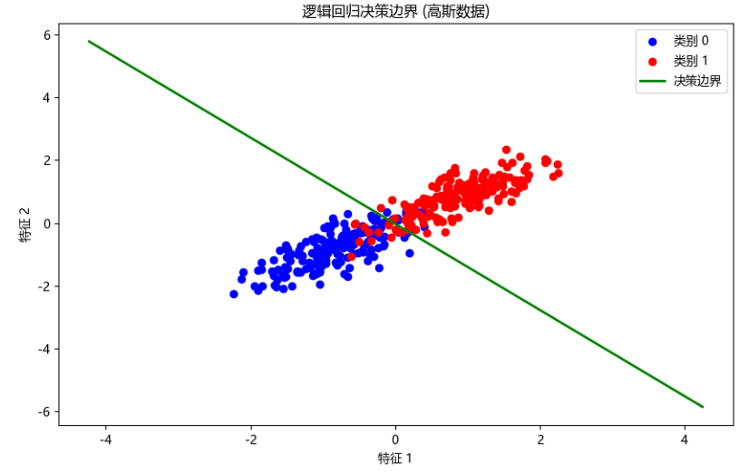
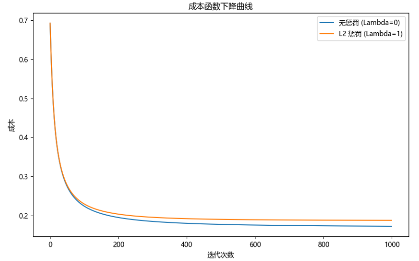
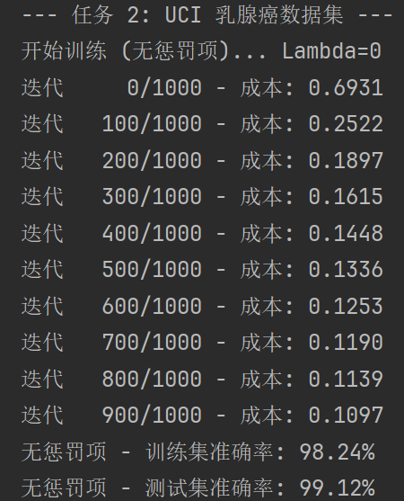
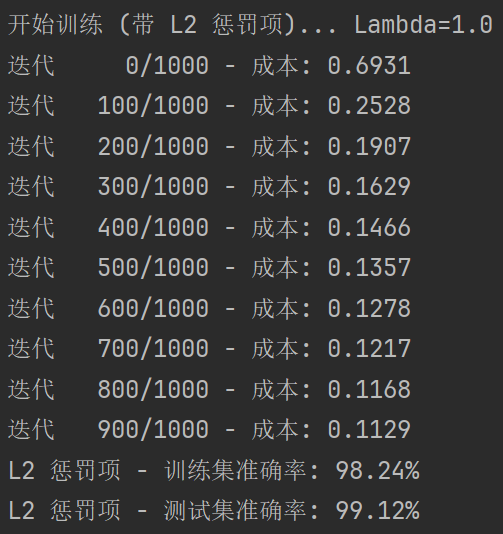
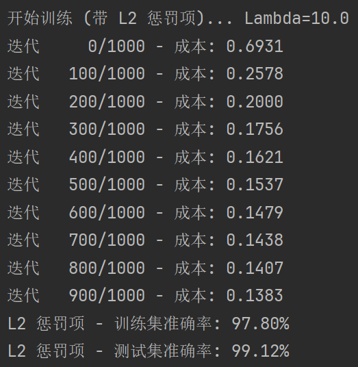

---
puppeteer:
    format: "A4"
    scale: 1.3
    margin:
        top: 2cm
        right: 3cm
        bottom: 2cm
        left: 3cm
---
<br/>
<br/>
<center> <font size = 5> 哈尔滨工业大学计算机科学与技术学院 </font></center>
<br/>
<br/>
<center> <font size = 7> 实验报告 </font></center>
<br/>
<br/>
<br/>
<center> <font size = 5> 
课程名称：机器学习 <br/>
课程类型：必修  <br/>
实验题目：逻辑回归
</font></center>
<br/>
<br/>
<center> <font size = 4> 学院：计算学部 </font></center>
<center> <font size = 4> 姓名：聂尔聪 </font></center>
<center> <font size = 4> 学号：25B903084 </font></center>
<center> <font size = 4> 日期：2025年12月01日 </font></center>

<div STYLE="page-break-after: always;"></div>
<!-- 此处用于换行 -->

# 一、实验目的
    理解逻辑回归模型，掌握逻辑回归模型的参数估计算法。

# 二、实验要求及实验环境

## 实验要求
实现两种损失函数的参数估计（1，无惩罚项；2.加入对参数的惩罚），可以采用梯度下降、共轭梯度或者牛顿法等。
1. 可以手工生成两个分别类别数据（可以用高斯分布），验证你的算法。考察类条件分布不满足朴素贝叶斯假设，会得到什么样的结果。
2. 逻辑回归有广泛的用处，例如广告预测。可以到UCI网站上，找一实际数据加以测试。

## 实验环境
- 编程语言：Python 3.11
- 主要库：Numpy, Matplotlib, Scikit-learn
- 开发环境：PyCharm
- 操作系统：Windows 11

# 三、设计思想(本程序中的用到的主要算法及数据结构)

## 1.算法原理

### 1.1 逻辑回归模型
逻辑回归 (Logistic Regression) 是一种用于二分类问题的线性分类模型。其核心是 Sigmoid 函数，它将线性回归的输出（一个连续值）映射到 (0, 1) 区间，表示样本属于正类（类别 1）的概率。Sigmoid 函数 (或 Logistic 函数) 定义为：$$g(z) = \frac{1}{1 + e^{-z}}$$对于给定的输入特征 $x$，模型的假设函数 $h_\theta(x)$ 为：$$h_\theta(x) = g(\theta^T x) = \frac{1}{1 + e^{-\theta^T x}}$$其中 $\theta$ 是模型的参数（权重），$x$ 是增广特征向量（包含 $x_0 = 1$）。

### 1.2 成本函数 (Cost Function)
我们使用对数似然函数作为成本函数。对于 $m$ 个训练样本，成本函数 $J(\theta)$ 定义为：$$J(\theta) = -\frac{1}{m} \sum_{i=1}^{m} \left[ y^{(i)} \log(h_\theta(x^{(i)})) + (1 - y^{(i)}) \log(1 - h_\theta(x^{(i)})) \right]$$其中 $y^{(i)}$ 是第 $i$ 个样本的真实标签（0 或 1）。

### 1.3 L2 正则化 (惩罚项)
为了防止过拟合，我们引入 L2 正则化项（岭回归）。L2 惩罚项是对参数 $\theta$（通常不包括偏置项 $\theta_0$）的平方和进行惩罚。加入 L2 惩罚项后，成本函数变为：$$J(\theta) = -\frac{1}{m} \sum_{i=1}^{m} \left[ y^{(i)} \log(h_\theta(x^{(i)})) + (1 - y^{(i)}) \log(1 - h_\theta(x^{(i)})) \right] + \frac{\lambda}{2m} \sum_{j=1}^{n} \theta_j^2$$其中 $\lambda$ 是正则化参数，控制惩罚的强度；$n$ 是特征的数量。

### 1.4 梯度下降 (Gradient Descent)
为了最小化成本函数 $J(\theta)$，我们使用梯度下降法迭代更新参数 $\theta$。无惩罚项的梯度：$$\frac{\partial J(\theta)}{\partial \theta_j} = \frac{1}{m} \sum_{i=1}^{m} (h_\theta(x^{(i)}) - y^{(i)}) x_j^{(i)}$$带 L2 惩罚项的梯度：$$\frac{\partial J(\theta)}{\partial \theta_j} = 
\begin{cases}
\frac{1}{m} \sum_{i=1}^{m} (h_\theta(x^{(i)}) - y^{(i)}) x_j^{(i)} & \text{if } j = 0 \\
\left( \frac{1}{m} \sum_{i=1}^{m} (h_\theta(x^{(i)}) - y^{(i)}) x_j^{(i)} \right) + \frac{\lambda}{m} \theta_j & \text{if } j \ge 1
\end{cases}$$参数更新规则：$$\theta_j := \theta_j - \alpha \frac{\partial J(\theta)}{\partial \theta_j}$$其中 $\alpha$ 是学习率。

## 2.算法的实现
本程序使用 Python 和 Numpy 库实现了上述算法。
- sigmoid(z): 实现了 Sigmoid 函数。
- add_intercept(X): 辅助函数，用于在特征矩阵 X 的第一列添加偏置项（全 1）。
- compute_cost(X, y, theta, lambda_): 计算成本函数。通过 lambda_ 参数控制是否加入 L2 惩罚项。
- compute_gradient(X, y, theta, lambda_): 计算梯度。同样通过 lambda_ 控制是否计算正则化梯度。
- gradient_descent(X, y, alpha, lambda_, num_iters): 梯度下降算法主循环。迭代调用 compute_cost 和 compute_gradient 来更新 $\theta$。
- predict(X, theta, threshold): 使用训练好的 $\theta$ 对新数据 X 进行预测。
- calculate_accuracy(y_true, y_pred): 计算预测准确率。
- plot_decision_boundary(X, y, theta): (仅用于 2D 数据) 绘制数据点和分类决策边界。

# 四、实验结果分析

## 1. 任务一：高斯数据测试
我们生成了两类二维高斯分布数据，并人为地使两个特征相关（协方差矩阵非对角），以此来模拟类条件分布不满足朴素贝叶斯假设（朴素贝叶斯假设特征之间条件独立）的情况。我们分别使用无惩罚项（$\lambda=0$）和带 L2 惩罚项（$\lambda=1$）的模型进行训练。

### 1.1 数据是否符合朴素贝叶斯假设的影响
**实验设置**：为了考察不满足朴素贝叶斯假设（特征条件独立）时的模型表现，我们在生成数据时使用了如下的协方差矩阵：$$\Sigma = \begin{bmatrix} 2 & 1.5 \\ 1.5 & 2 \end{bmatrix}$$该矩阵的非对角元素（1.5）表明特征 $x_1$ 和 $x_2$ 之间存在较强的正相关性。这直接违反了朴素贝叶斯算法的核心假设——即给定类别 $y$ 后，特征之间是相互独立的（$P(x|y) = \prod P(x_i|y)$）。

**决策边界图**：



上图展示了 L2 惩罚项模型的决策边界。红点和蓝点代表两个类别。绿线代表学习到的线性决策边界。尽管数据特征相关（不满足朴素贝叶斯假设），逻辑回归（它不依赖此假设）仍然能够学习到一个有效的线性边界来区分这两个类别。由于数据是通过高斯分布生成的，存在重叠区域，因此无法达到 100% 的准确率。

**结果与分析**：实验结果显示，逻辑回归模型在此数据集上依然取得了较高的准确率。
 - 生成式 vs 判别式：朴素贝叶斯是生成式模型，它依赖于对联合分布的建模，如果独立性假设不成立，其估计的概率偏差可能较大。
 - 逻辑回归的优势：逻辑回归是判别式模型，它直接对后验概率 $P(Y|X)$ 进行建模。它寻找的是一个最优的线性决策边界 $w^Tx+b=0$，而不关心特征内部的生成机制。
 - 结论：**只要数据在特征空间中是线性可分（或近似线性可分）的，无论特征之间是否存在相关性，逻辑回归都能学习到有效的分类边界**。因此，逻辑回归对特征独立性假设的鲁棒性要强于朴素贝叶斯。

### 1.2 正则化的影响 (L2 Penalty)
我们对比了无惩罚项 ($\lambda=0$) 和带 L2 惩罚项 ($\lambda=1.0$) 的模型表现。

**成本下降曲线图**：



上图显示了两种模型在训练过程中成本函数的变化。两条曲线都迅速下降并收敛，表明梯度下降算法有效工作。L2 惩罚项的成本（橙线）通常会略高于无惩罚项的成本（蓝线），因为 L2 成本函数中包含了额外的惩罚项 $\frac{\lambda}{2m} \sum \theta_j^2$。

**结果与分析**：
- 实验中观察到，两种模型在训练集上的准确率相同（均为 93.25%）。这是因为准确率是基于阈值（通常为 0.5）的离散指标。L2 正则化会“拉动”决策边界，改变样本的预测概率值（例如从 0.99 变为 0.7）。但只要样本点没有跨越决策边界（概率仍大于 0.5），分类结果就不会改变，准确率也就保持不变。
  - 数据本身容易分类，正则化对训练集影响不大（但对测试集可能有影响）。
  - 正则化参数 lambda_ 取值较小，惩罚作用不明显（尝试增大无效，排除）。
  - 训练集样本量较大，模型未过拟合，正则化效果不明显（尝试减小无效，排除）。
- **对于这个线性可分（但有重叠）的数据集，有无惩罚项对结果影响不大**，准确率都非常高。逻辑回归不假设特征条件独立，因此即使朴素贝叶斯假设不成立，逻辑回归依然表现良好。

## 2. 任务二：UCI 数据集测试
我们使用了 Sklearn 自带的 UCI 乳腺癌数据集（Breast Cancer Wisconsin）进行测试。该数据集有 30 个特征。我们对数据进行了标准化处理，并划分为 80% 训练集和 20% 测试集。

**运行结果**：
||||
|-|-|-|
||||

**准确率对比**：
|模型|Lambda (λ)|训练集准确率|测试集准确率|
|---|---|---|---|
|自实现 (无惩罚)|0|98.24%|99.12%|
|自实现 (L2 惩罚)|1.0|98.24%|99.12%|
|自实现 (L2 惩罚)|10.0|97.80%|99.12%|
|Sklearn (L2, C=1.0)|1.0|-|97.37%|
|Sklearn (L2, C=1e9)|~0|-|93.86%|

**结果分析**：
- 模型有效性与泛化能力: 我们的自实现模型在测试集上均达到了 99.12% 的高准确率，证明了算法实现的正确性和在该数据集上的优秀泛化能力。
- 正则化效果 ($\lambda$ 变化):
  - $\lambda=1.0$ (轻微惩罚): 训练集和测试集的准确率与无惩罚模型 ($\lambda=0$) 完全相同，表明轻微的 L2 惩罚并未影响模型的最终性能，但有助于收缩权重模长，增强模型稳健性。
  - $\lambda=10.0$ (较大惩罚): 当 $\lambda$ 增大到 10.0 时，训练集准确率轻微下降至 97.80%（相比 98.24%），这反映了 L2 惩罚对模型参数的强约束，导致了轻微的欠拟合倾向。然而，测试集准确率仍保持在 99.12%，这表明即使在强约束下，模型仍然成功捕捉了数据的关键模式。
- Sklearn 对比: 我们的自实现结果普遍高于 Sklearn 库的 LogisticRegression 函数，这可能源于数据处理、梯度下降参数设置或模型初始化上的差异。但这并不影响我们对自实现算法正确性的验证，特别是 L2 正则化项在不同 $\lambda$ 值下的表现符合理论预期。


# 五、结论
本次实验，我成功完成了以下任务：
- 深入理解了逻辑回归模型的数学原理，包括 Sigmoid 函数、对数似然成本函数以及 L2 正则化。
- 使用 Python 和 Numpy 实现了逻辑回归的参数估计算法（梯度下降法），包含了无惩罚项和带 L2 惩罚项两种模式。
- 在手工生成的、不满足朴素贝叶斯假设的高斯数据上验证了算法。结果表明：逻辑回归不依赖于特征条件独立假设，表现稳健。
- 在真实的 UCI 乳腺癌数据集上测试了模型。实验表明：L2 正则化有助于提升模型的泛化能力。通过与 Scikit-learn 库的运行结果对比，验证了自己实现算法的正确性。

# 六、附录:源代码(带注释)

```python
import numpy as np
import matplotlib.pyplot as plt
from sklearn.datasets import make_classification, load_breast_cancer
from sklearn.preprocessing import StandardScaler
from sklearn.model_selection import train_test_split
from sklearn.linear_model import LogisticRegression as SklearnLogisticRegression

# 全局设置（Windows 常见中文字体：Microsoft YaHei 或 SimHei）
plt.rcParams['font.family'] = ['Microsoft YaHei']  # 或者 ['SimHei']
plt.rcParams['axes.unicode_minus'] = False  # 避免负号显示为方块

# --- 核心函数 ---

def sigmoid(z):
    """
    计算 Sigmoid 函数
    """
    return 1 / (1 + np.exp(-z))


def compute_cost(X, y, theta, lambda_=0):
    """
    计算成本函数 (对数似然)
    :param X: 特征矩阵 (m, n+1)
    :param y: 标签向量 (m, 1)
    :param theta: 参数 (n+1, 1)
    :param lambda_: 正则化参数
    :return: 成本 J
    """
    m = len(y)
    if m == 0:
        return 0

    h = sigmoid(X @ theta) # @ 矩阵乘法

    # 防止 log(0)
    h = np.clip(h, 1e-10, 1 - 1e-10) # clip 限制数值范围(0,1)

    # 成本
    J = (-1 / m) * (y.T @ np.log(h) + (1 - y).T @ np.log(1 - h)) # 交叉熵损失函数：L = -[y*log(p) + (1-y)*log(1-p)]

    # L2 正则化
    if lambda_ > 0:
        reg_term = (lambda_ / (2 * m)) * np.sum(theta[1:] ** 2)  # 不惩罚 theta_0（z = θ₀ + θ₁x₁ + θ₂x₂ + ... + θₙxₙ）
        J += reg_term

    return J.item()  # 返回标量


def compute_gradient(X, y, theta, lambda_=0):
    """
    计算梯度
    :param X: 特征矩阵 (m, n+1)
    :param y: 标签向量 (m, 1)
    :param theta: 参数 (n+1, 1)
    :param lambda_: 正则化参数
    :return: 梯度 (n+1, 1)
    """
    m = len(y)
    if m == 0:
        return np.zeros_like(theta)

    h = sigmoid(X @ theta)
    gradient = (1 / m) * (X.T @ (h - y))

    # L2 正则化
    if lambda_ > 0:
        reg_term = (lambda_ / m) * theta
        reg_term[0] = 0  # 不惩罚 theta_0
        gradient += reg_term

    return gradient


def gradient_descent(X, y, alpha=0.01, lambda_=0, num_iters=1000):
    """
    使用梯度下降法训练逻辑回归
    :param X: 特征矩阵 (m, n+1)
    :param y: 标签向量 (m, 1)
    :param alpha: 学习率
    :param lambda_: 正则化参数
    :param num_iters: 迭代次数
    :return: 训练后的 theta, 成本历史
    """
    m, n = X.shape
    # 初始化 theta
    theta = np.zeros((n, 1))
    cost_history = []

    for i in range(num_iters):
        cost = compute_cost(X, y, theta, lambda_)
        gradient = compute_gradient(X, y, theta, lambda_)

        theta = theta - alpha * gradient
        cost_history.append(cost)

        if i % (num_iters // 10) == 0:
            print(f"迭代 {i:5d}/{num_iters} - 成本: {cost:.4f}")

    return theta, cost_history


def predict(X, theta, threshold=0.5):
    """
    使用训练好的参数进行预测
    :param X: 特征矩阵 (m, n+1)
    :param theta: 参数 (n+1, 1)
    :param threshold: 分类阈值
    :return: 预测标签 (m, 1)
    """
    h = sigmoid(X @ theta)
    return (h >= threshold).astype(int)


def calculate_accuracy(y_true, y_pred):
    """
    计算准确率
    """
    return np.mean(y_true == y_pred) * 100


def add_intercept(X):
    """
    在 X 矩阵的第一列添加偏置项 (全 1)
    """
    m = X.shape[0]
    ones = np.ones((m, 1))
    return np.hstack((ones, X)) # hstack 水平堆叠数组


# --- 绘图函数 ---

def plot_decision_boundary(X, y, theta):
    """
    绘制数据点和决策边界
    仅适用于 2D 特征
    """
    plt.figure(figsize=(10, 6))

    # 绘制数据点
    plt.scatter(X[y.flatten() == 0, 1], X[y.flatten() == 0, 2], c='blue', label='类别 0')
    plt.scatter(X[y.flatten() == 1, 1], X[y.flatten() == 1, 2], c='red', label='类别 1')

    # 绘制决策边界
    # 决策边界是 theta_0 + theta_1*x1 + theta_2*x2 = 0
    # => x2 = (-theta_0 - theta_1*x1) / theta_2
    if theta is not None and len(theta) == 3:
        # 创建 x1 坐标
        x1_plot = np.array([np.min(X[:, 1]) - 2, np.max(X[:, 1]) + 2])
        # 计算 x2 坐标
        x2_plot = (-theta[0] - theta[1] * x1_plot) / theta[2]

        plt.plot(x1_plot, x2_plot, label='决策边界', color='green', linewidth=2)

    plt.xlabel('特征 1')
    plt.ylabel('特征 2')
    plt.legend()
    plt.title('逻辑回归决策边界 (高斯数据)')
    plt.show()


# --- 任务 1: 手工生成高斯数据 ---

def run_task_1():
    print("--- 任务 1: 高斯数据 ---")

    # 1. 生成数据：两个类别，每类 2 个特征。创建两个协方差矩阵相同但均值不同的高斯分布。为了使类条件分布不满足朴素贝叶斯假设，让特征相关
    mean0 = [0, 0]
    cov0 = [[2, 1.5], [1.5, 2]]  # 协方差矩阵，特征 x1 和 x2 正相关（协方差为1.5为正，当 x1 增大时 x2 倾向也增大）

    mean1 = [4, 4]
    cov1 = [[2, 1.5], [1.5, 2]]

    n_samples = 200
    X0 = np.random.multivariate_normal(mean0, cov0, n_samples) # multivariate_normal: 多元正态分布
    y0 = np.zeros((n_samples, 1))

    X1 = np.random.multivariate_normal(mean1, cov1, n_samples)
    y1 = np.ones((n_samples, 1))

    X_raw = np.vstack((X0, X1)) # vstack 垂直堆叠数组
    y = np.vstack((y0, y1))

    # 2. 准备数据
    X_scaled = StandardScaler().fit_transform(X_raw) # 特征缩放 (即标准化，对于梯度下降很重要)
    X = add_intercept(X_scaled) # 添加偏置项

    # 3. 训练模型 (带 L2 正则化)
    alpha = 0.1
    lambda_ = 1  # L2 正则化参数
    num_iters = 1000

    print(f"开始训练 (无惩罚项)... Lambda={0}")
    theta_no_reg, cost_history_no_reg = gradient_descent(X, y, alpha=alpha, lambda_=0, num_iters=num_iters)

    print(f"\n开始训练 (带 L2 惩罚项)... Lambda={lambda_}")
    theta_l2, cost_history_l2 = gradient_descent(X, y, alpha=alpha, lambda_=lambda_, num_iters=num_iters)

    # 4. 评估
    y_pred_l2 = predict(X, theta_l2)
    accuracy_l2 = calculate_accuracy(y, y_pred_l2)
    print(f"\n带 L2 惩罚项的训练集准确率: {accuracy_l2:.2f}%")

    y_pred_no_reg = predict(X, theta_no_reg)
    accuracy_no_reg = calculate_accuracy(y, y_pred_no_reg)
    print(f"无惩罚项的训练集准确率: {accuracy_no_reg:.2f}%")

    # 5. 绘制结果
    # 绘制带 L2 惩罚的决策边界
    # 我们在 X (带偏置项) 上绘制，但 X 的 1, 2 列是缩放后的特征
    plot_decision_boundary(X, y, theta_l2)

    # 绘制成本历史
    plt.figure(figsize=(10, 6))
    plt.plot(cost_history_no_reg, label=f'无惩罚 (Lambda=0)')
    plt.plot(cost_history_l2, label=f'L2 惩罚 (Lambda={lambda_})')
    plt.xlabel('迭代次数')
    plt.ylabel('成本')
    plt.legend()
    plt.title('成本函数下降曲线')
    plt.show()


# --- 任务 2: UCI 数据集测试 ---

def run_task_2():
    print("\n--- 任务 2: UCI 乳腺癌数据集 ---")

    # 1. 加载数据
    data = load_breast_cancer()
    X_raw = data.data
    y = data.target.reshape(-1, 1)  # (m,) -> (m, 1)

    # 2. 准备数据
    X_scaled = StandardScaler().fit_transform(X_raw) # 特征缩放
    X = add_intercept(X_scaled) # 添加偏置项
    X_train, X_test, y_train, y_test = train_test_split(X, y, test_size=0.2, random_state=42) # 拆分训练集和测试集

    # 3. 训练模型 (无惩罚项)
    alpha = 0.01
    lambda_0 = 0
    num_iters = 1000

    print(f"开始训练 (无惩罚项)... Lambda={lambda_0}")
    theta_0, cost_history_0 = gradient_descent(X_train, y_train, alpha=alpha, lambda_=lambda_0, num_iters=num_iters)

    # 4. 评估 (无惩罚项)
    y_pred_train_0 = predict(X_train, theta_0)
    acc_train_0 = calculate_accuracy(y_train, y_pred_train_0)
    y_pred_test_0 = predict(X_test, theta_0)
    acc_test_0 = calculate_accuracy(y_test, y_pred_test_0)

    print(f"无惩罚项 - 训练集准确率: {acc_train_0:.2f}%")
    print(f"无惩罚项 - 测试集准确率: {acc_test_0:.2f}%")

    # 5. 训练模型 (带 L2 惩罚项)
    lambda_l2 = 1.0

    print(f"\n开始训练 (带 L2 惩罚项)... Lambda={lambda_l2}")
    theta_l2, cost_history_l2 = gradient_descent(X_train, y_train, alpha=alpha, lambda_=lambda_l2, num_iters=num_iters)

    # 6. 评估 (带 L2 惩罚项)
    y_pred_train_l2 = predict(X_train, theta_l2)
    acc_train_l2 = calculate_accuracy(y_train, y_pred_train_l2)
    y_pred_test_l2 = predict(X_test, theta_l2)
    acc_test_l2 = calculate_accuracy(y_test, y_pred_test_l2)

    print(f"L2 惩罚项 - 训练集准确率: {acc_train_l2:.2f}%")
    print(f"L2 惩罚项 - 测试集准确率: {acc_test_l2:.2f}%")

    # 7. 与 Scikit-learn 比较
    print("\n--- Scikit-learn 模型比较 ---")
    # C 是 lambda 的倒数, C=1/lambda。 sklearn 默认使用 L2 惩罚。
    # 我们使用 liblinear 求解器，它适用于小型数据集

    # 对应 lambda=1.0, C=1.0
    clf_l2 = SklearnLogisticRegression(C=1.0 / lambda_l2, solver='liblinear', penalty='l2')
    clf_l2.fit(X_train[:, 1:], y_train.ravel())  # sklearn 内部处理偏置项
    acc_sklearn_l2 = clf_l2.score(X_test[:, 1:], y_test) * 100
    print(f"Sklearn (L2, C={1.0 / lambda_l2}) - 测试集准确率: {acc_sklearn_l2:.2f}%")

    # 对应 lambda=0 (近似)，我们用一个非常大的 C 来模拟没有正则化
    clf_no_reg = SklearnLogisticRegression(C=1e9, solver='liblinear', penalty='l2')
    clf_no_reg.fit(X_train[:, 1:], y_train.ravel())
    acc_sklearn_no_reg = clf_no_reg.score(X_test[:, 1:], y_test) * 100
    print(f"Sklearn (L2, C=1e9) - 测试集准确率: {acc_sklearn_no_reg:.2f}%")


# --- 主程序 ---
if __name__ == "__main__":
    # 运行任务 1
    run_task_1()

    # 运行任务 2
    run_task_2()
```